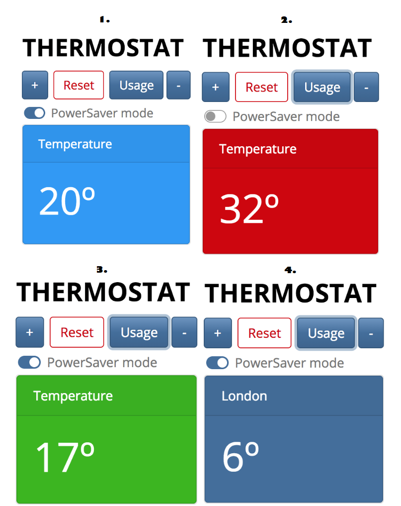

# Thermostat
-------------

Project objective was to build fully functional thermostat. I have used the following technology:

* JavaScript with Jasmine(for TDD),
* JQuery,
* Bootstrap's Bootswatch,
* CSS for custom animations,
* 3rd party API for weather updates

**Application functionality:**

* Thermostat starts at 20 degrees
* You can increase the temperature with an up function
* You can decrease the temperature with a down function
* The minimum temperature is 10 degrees
* If power saving mode is on, the maximum temperature is 25 degrees
* If power saving mode is off, the maximum temperature is 32 degrees
* Power saving mode is on by default
* You can reset the temperature to 20 with a reset function
* You can ask about the thermostat's current energy usage: < 18 is low-usage, < 25 is medium-usage, anything else is high-usage.
(low-usage will be indicated with green, medium-usage indicated with black, high-usage indicated with red.)

**How to test my application?**

```
1. Please clone this repository: git clone https://github.com/KrzysztofBalejko/thermostat.git
2. Open index.html in your browser.
3. Have fun!
```

**Please see below screenshots**


